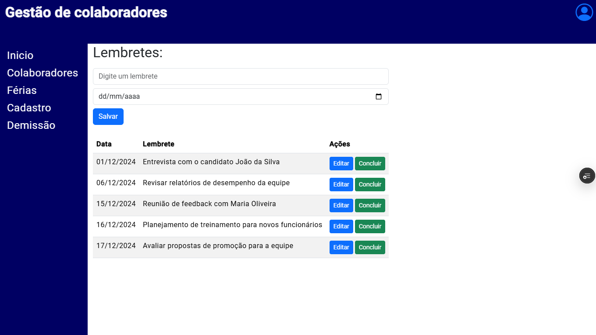

# Projeto Colaboradores

## Descrição

Este é um projeto Angular para gerenciar colaboradores, incluindo funcionalidades como cadastro, edição, demissão e gerenciamento de férias.

## Estrutura do Projeto

- **Menu**: Navegação entre as diferentes seções do aplicativo.
- **Início**: Página inicial com lembretes.
- **Colaboradores**: Listagem e edição de colaboradores.
- **Cadastro**: Formulário para cadastrar novos colaboradores.
- **Férias**: Gerenciamento de férias dos colaboradores.
- **Demissão**: Processo de demissão de colaboradores.

## Tecnologias Utilizadas

- Angular
- Bootstrap

## Como Executar

1. Clone o repositório.
2. Instale as dependências com `npm install`.
3. Execute o projeto com `npm start`.

## Scripts Disponíveis

- `ng`: Executa o Angular CLI.
- `start`: Inicia o servidor de desenvolvimento.
- `build`: Compila o projeto.
- `watch`: Compila o projeto em modo de observação.
- `test`: Executa os testes.
- `serve:ssr:colaboradores`: Inicia o servidor SSR.

## Estrutura de Pastas

- `src/app`: Contém os componentes do Angular.
- `public`: Contém arquivos públicos, como imagens.

## Dependências

- Angular
- Bootstrap
- Express
- RxJS
- Zone.js

## Contribuição

Sinta-se à vontade para contribuir com o projeto. Faça um fork e envie um pull request com suas melhorias.

## Licença

Este projeto está licenciado sob a licença MIT.
